# ART-SAFEBOX
A Group Project code implementation of The HK PolyU COMP3334 Computer System Security of Group 39.
This is a Client/Server based system which is built as a safe guarded digital artwork exchanging platform.

## System Design
- Client/Server Architecture
- [Django](https://www.djangoproject.com) Python Server
- [jQuery AJAX](https://api.jquery.com/jquery.ajax/) JavaScript Front-end
- [SQLite](https://www.sqlite.org/index.html) Database (with [API support of Django](https://docs.djangoproject.com/zh-hans/4.0/ref/databases/#mysql-notes))
- HTTPS SSL/TLS1.3 Protocol
- CSS supported by [BootStrap5](https://blog.getbootstrap.com/2021/05/05/bootstrap-5/)
- Web Image Viewer: [Viewer.js](https://fengyuanchen.github.io/viewerjs/)

### Backend Design
#### The UML Class Diagram
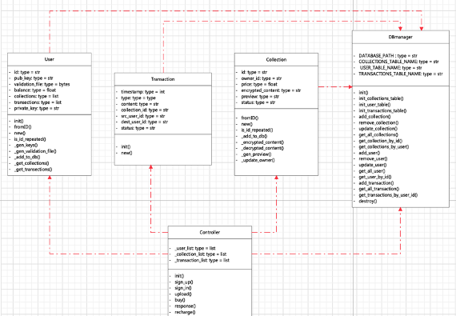
- **DBmanager**: The Database manager for creating un-existing table, doing write, read, update, delete in the database.
- **User**: The object represents the User.
- **Transaction**: Object for messages and requests sending from or to users.
- **Collections**: The object represents the artwork.
- **Controller**: Execute specific tasks of the website/server.

#### The Entity Relationship Diagram of Database
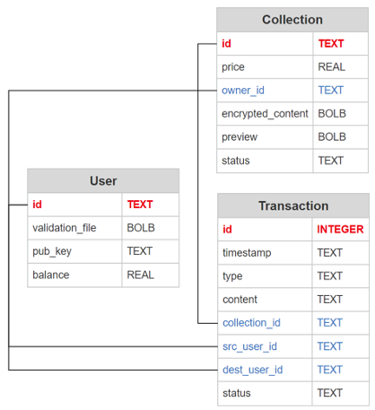
- **User**: 
  - User ID: The primary key, indicating user's identity.
  - Validation File: Decrypted by RSA Public Key. Containing the AES key for en/decrypting the user's collections.
  - Public Key: The RSA Public Key of the User
  - Balance: The balance of the user.

- **Collection**:
  - Collection ID: The primary key, indicating the collection's identity. The collection id is the title of the collection here.
  - Owner ID: A user ID of the collection's Owner
  - Encrypted Content: The content of the collection encrypted by the owner's RSA public key.
  - Preview: The preview of the Collection. Here it is an image of the original content in 1/4 size.
  - Statues: 
    - Pending (The collection is under exchanging) 
    - Confirmed(All except under exchanging). 

- **Transaction**:
  - Transaction ID: The primary key, indicating the transaction's identity.
  - Timestamp: At which time the transaction is made.
  - Type: 
    - Message (A msg to notice the Dest User) 
    - Request (A buying request from buyer to seller)
  - Content: The text message of the transaction. e.g. 
    - "You have accepted Xavier's buying request"(System -> User)/
    - "I have rejected your Buying request."(Seller -> Buyer)
  - Source User ID: The User ID of whom launch this transaction.
  - Destination User ID: The User ID of whom the transaction is sent to.
  - Status: 
    - Pending (Waiting for Dest User responding)
    - Rejected (Dest User rejected the request)
    - Accepted (Dest User accepted the request)
    - Closed (Transaction done)
    - Seen (Visible to User)
    - Unseen(Invisible to User, for debug purpose)

### Client Design
#### [index.html](templates/index.html)

The default webpage.

#### [signin.html](templates/signin.html)

The signin page.
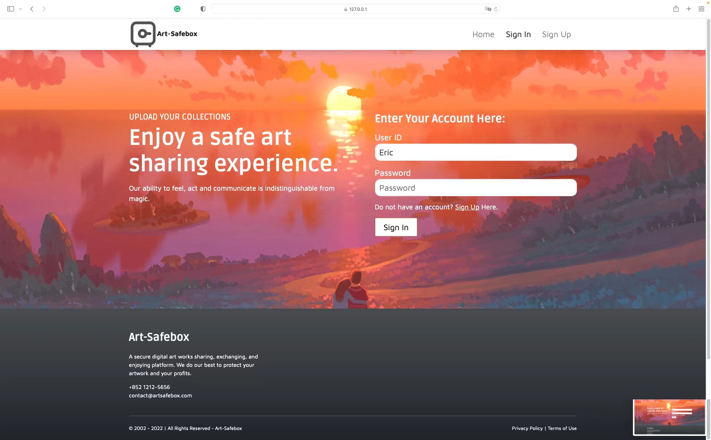

#### [signup.html](templates/signup.html)

The signup page.
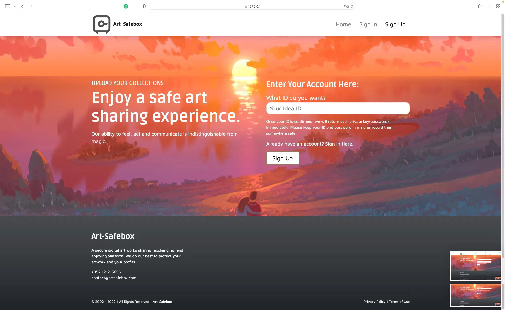

#### [home.html](templates/home.html)

The home page after signin. Purchase request can be sent here.
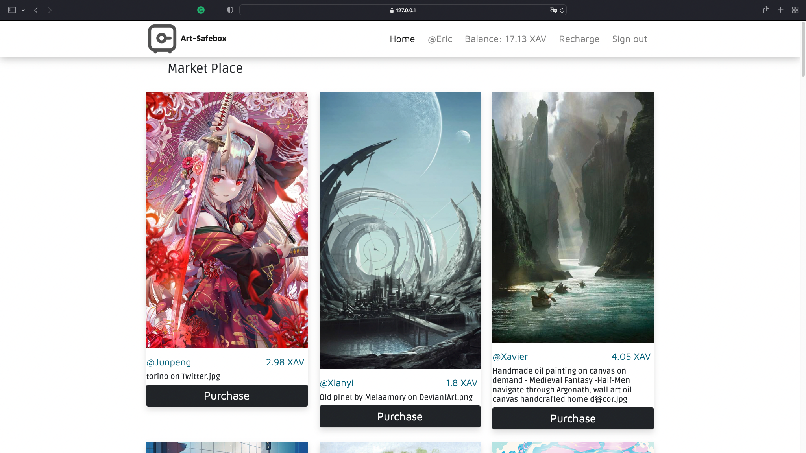

#### [personal.html](templates/personal.html)

The personal main page after signin. Downloading/uploading collections, accept/reject other's buying request can be done
here and other notices can be seen here.
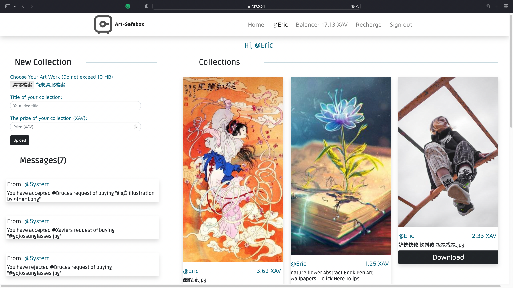

#### [others.html](templates/others.html)

The other's personal main page after signin.
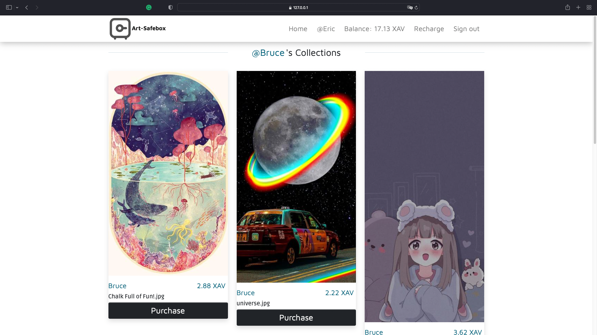

#### [others_unsigned.html](templates/others_unsigned.html)

The other's personal main page before signin.
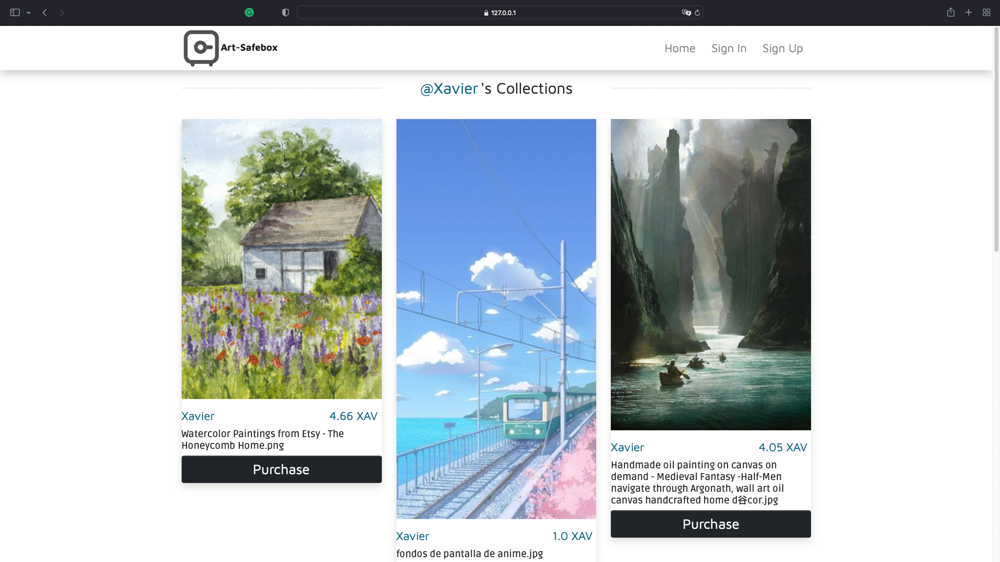

## Security
### [Backend](ART_SAFEBOX/backend.py)
#### User Register
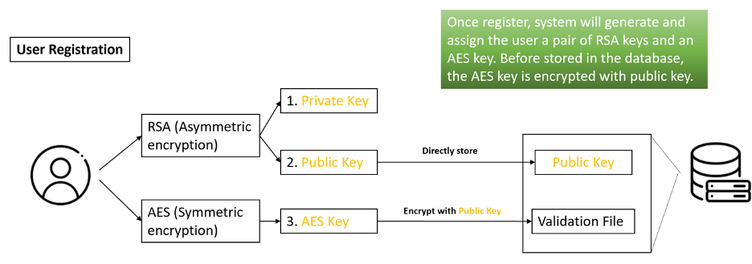

During the register, a key pair of RSA cipher, an AES key are randomly generated. The AES key will be encrypted by the 
RSA public key and stored in the validation file. The RSA public key will be store in the server database while the 
private will be returned to the user as the login password. The server won't store the RSA private key, only cache and 
use it when necessary. 

Methods to verify whether the account and password match: The validation file contains the user's AES key and ID. During
signin, the server will try to decrypt the validation file by the password(RSA private key), if decryption failed or the
decrypted user ID is not equal to the user ID then the account and password is not match. Otherwise, they are match.

#### User Uploading an Artwork
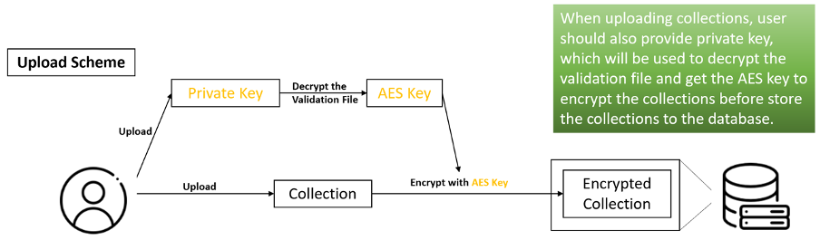

Once an artwork along with its title(recognized as collection ID) and price is upload to the server. The server will 
decrypt the validation file(containing the user's AES key) of the user and use the AES key to encrypt the content of 
the artwork. The preview (1/4 size of the raw data here) of the artwork is generated at the same time.

#### Artwork Exchange Scheme
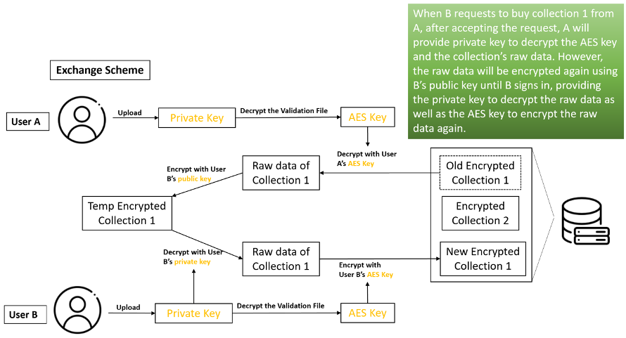

Once the owner of an artwork accepts a buyers buying request. The encrypted data of the collection will be decrypted by 
the owner's AES key and be encrypted again by the buyer's RSA public key (which may take a while) because we are not 
sure whether the buyer is online. At the next signin of the buyer, the artwork will be decrypted by the buyer's private
key automatically and be encrypted again by the buyer's AES key.

Because the private key will not be stored on the server, and the artwork data on the server is encrypted, the loss of 
data can be guaranteed to be very small even if the database is leaked or subjected to a short-term scripting attack and
control scramble. 

### Communication
#### HTTPS SSL/TLS1.3
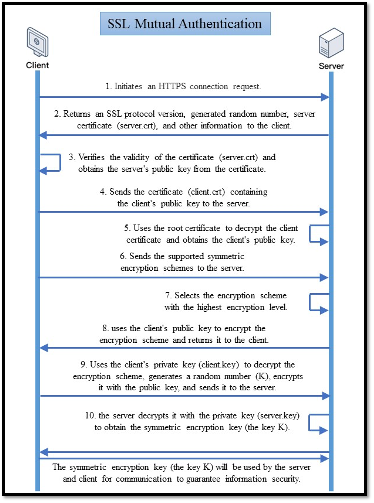

An RSA shake-hand for exchanging the AES key, then using the AES key for communication.

#### Session and Cookies

During signin, the server will check whether the account(user ID) and password(the RSA private key) are match. If so, 
the account and password along with the sign in time will be decrypted by random generated AES key and stored in python 
objects. The AES key will be returned as cookies item "info". The user ID will be returned as the cookies item "uid" as 
well. Thus, if the request sent to the server has cookies content i.e. "info" and "uid", the server will try to decrypt 
the account and password stored before, if failed, the cookies will be erased, and a 404 respond will be sent back. If 
not, the server will handle the request in a pre-defined way. The expiry time is set to 20 minutes. If no request is 
sent for more than 20 mins, at next request, the cookies will be erased, and the user will be asked to signin again. The
account, password, and signin time of the user will be deleted as well. Otherwise, the signin time will be reset.

Details in [views.py](ART_SAFEBOX/views.py), [accounts.py](ART_SAFEBOX/accounts.py), 
[AESCipher.py](ART_SAFEBOX/AESCipher.py).

The good thing of this procedure is that, the plaintext password(private key) of the user won't be stored at either 
server or browser(client) which improves the security. The user is only allowed to sign in at a single device in a 
single browser, because the AES key is random generated for each single sign in. In addition, signin timed out will be 
logged out automatically.

## Demonstration

If you cannot access the demo video via YouTube, you can download it [here](images4readme/demo.mov).

## Limitations
### Long and unchangeable password.
Since the password is the randomly generated RSA private key, which is long and cannot be changed by the user, it is 
very inconvenient for users to store or remember it. In addition, once the user lost his/her password, s/he will no long
use this account. New procedures needs to be added to fix the problem, e.g. email servers to send emails to the user to
acquire passwords; use some hash algorithms and mapping to make it possible for user defining their password themselves.

### Time-consuming en/decryption of RSA
This is a reason why we use blended AES, RSA cipher to en/decryption the data. However, during exchanging artworks, RSA
will be used for directly en/decrypting an artwork. We found that it costs about 5 mins for a single thread to decrypt a
10MB image and about 90s for 10 threads (which is dangerous) to do the same task. So we decided to use asynchronous 
threads to encrypt/decrypt data, but it seems Django doesn't support using the native Python Thread class to do so, 
because even if you put a task into a child Thread, the parent Thread will wait for the child Thread to finish before 
continuing. Therefore, celery may need to be added for asynchronous task deployment.

### Poor concurrent processing capability
Django's design flaw prevents it from processing multiple requests at the same time, and Django runs on Python, which 
means it is not efficient to execute. Therefore, the project will require users to wait for a long time to process large
artwork, but we have tried our best to ensure that the program does not go wrong.

## File Structures:
../  
├── ART_SAFEBOX/  
│    └── `__init__.py `  (Empty file)  
│    └── `accounts.py `  (Online accounts manager)  
│    └── `AESCpiher.py`  (AES Cipher support for accounts.py)  
│    └── `asgin.py    `  (Empty file)  
│    └── `backend.py  `  (Database, User states, Collections, and Transactions manager)   
│    └── `models.py   `  (Function caller of backend.py)  
│    └── `settings.py `  (Django configs)  
│    └── `urls.py     `  (Urls setter)  
│    └── `views.py    `  (Request handler)  
│    └── `wsgi.py     `  (Empty file)  
├── Certificate/  (Folder of certificate)   
│    └── ...  
├── static/  (static folder of Django)  
│    └── `blocks.css  `  (Custom `.css`)     
│    └── `js/custom.js`  (Custom JavaScript)   
│    └── previews/  (Folders of collection previews)  
│    └── ...       
├── templates/  (`.html` folder of Django)  
│    └── ...  
├── `db.sqlite3 `  (Database)   
├── `makeCA.sh  `  (`.sh` file for generating a certificate)   
├── `Start.sh   `  (`.sh` file for starting the server)    
├── `manage.py  `  (`main` of Django)   
└── README.md   
└── ...   

## System Installation Guide
### Requirements
- Operating System: OS X, Windows(not tested)
- Suggested IDE: Pycharm
- Suggested Browser: Chrome, Safari
- Package Dependencies: Run `pip install requreiments.txt`

### Set the certificate for SSL communication:
1. `cd` the current working path to the same path where the file [`makeCA.sh`](makeCA.sh) is.
2. Run `sh makeCA.sh`
3. Then you can find the generated certificate under directory Certificate.
4. There is also a selection to generate a certificate: [mkcert](https://github.com/FiloSottile/mkcert). But please note
that the created certificate will be stored on your computer permanently and have the ability to bypass the browsers' 
security mechanism.
5. **Please never share your certificate to others.**

### Start the server:
1. `cd` the current working path to the same path where the file [`Start.sh`](Start.sh) is.
2. Run `sh Start.sh`

### Start the client:
1. Go to Chrome or Safari, enter [`https://127.0.0.1:8000`](https://127.0.0.1:8000)
2. If Chrome prevents you from opening the website, type `thisisunsafe` anywhere, the website will be opened.
3. Here are some collections and users are already stored in the database, you can find the account and password from
'accounts.txt'

### Notes:
1. Currently, only `*.JPG` or `*.PNG` images can be uploaded, and the size cannot exceed 10MB. Otherwise, the server 
will reject the request.
2. Since Django can't handle more than one request at a time, wait patiently for the server to respond when performing 
time-consuming requests (upload, download, accept a transaction, first signin after the request is accepted).
3. It is normal for terminal to display exceptions because we add `traceback.print_exc()` to all except parts of `try:` 
`except:` pair for debugging purposes. The server can perform tasks properly.
4. Once the server is restarted, all users need to sign in again because session information is stored only in 
variables.

## Team Members
- Bruce:  [Bruce312](https://github.com/Bruce312)
- Eric:   [WPCJATH](https://github.com/WPCJATH)
- Junpen: [Yang0303PP](https://github.com/YangJunPeng19990303)
- Xavier: [X3vvv](https://github.com/X3vvv)
- Xianyi: [Azunyan-bot](https://github.com/Azunyan-bot)

